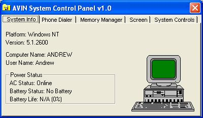



## AVIN Everything Program

### Description

This program does EVERYTHING (hence the name)! It dials and stores phone numbers, tells you operating system and network information, shows memory status, can change screen resolutions and much, MUCH more!

Vote For Me!
 
### More Info
 

             |
---                |---
**Submitted On**   |2002-11-13 16:58:04
**By**             |[Pnut V](https://github.com/Planet-Source-Code/PSCIndex/blob/master/ByAuthor/pnut-v.md)
**Level**          |Advanced
**User Rating**    |4.7 (42 globes from 9 users)
**Compatibility**  |VB 3\.0, VB 4\.0 \(16\-bit\), VB 4\.0 \(32\-bit\), VB 5\.0, VB 6\.0, VB Script, ASP \(Active Server Pages\) , VBA MS Access, VBA MS Excel
**Category**       |[Windows System Services](https://github.com/Planet-Source-Code/PSCIndex/blob/master/ByCategory/windows-system-services__1-35.md)
**World**          |[Visual Basic](https://github.com/Planet-Source-Code/PSCIndex/blob/master/ByWorld/visual-basic.md)
**Archive File**   |[AVIN\_Every14968111132002\.zip](https://github.com/Planet-Source-Code/pnut-v-avin-everything-program__1-40667/archive/master.zip)

